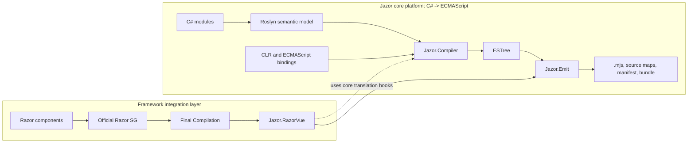

<div align="center">


<h1>Jazor</h1>

<p><strong>A typed .NET toolchain for compiling supported C# semantics into deterministic ECMAScript modules.</strong></p>

<p>
  <a href="https://dotnet.microsoft.com/"></a>
  <a href="https://www.nuget.org/packages/Jazor"></a>
  <a href="https://github.com/devhxj/Jazor/releases/latest"></a>
  <a href="https://github.com/devhxj/Jazor/actions/workflows/razorvue-ci.yml"></a>
  <a href="LICENSE.txt"></a>
</p>

<p>
  <a href="docs/04-roadmap/current-status.md"></a>
  <a href="docs/04-roadmap/current-status.md"></a>
  <a href="docs/04-roadmap/current-status.md"></a>
</p>

<p><strong>English</strong> · <a href="README_CN.md">简体中文</a></p>

</div>

> Jazor is experimental. Public APIs and generated artifact shapes may evolve.

Jazor is a typed .NET toolchain for compiling supported C# semantics into deterministic ECMAScript modules. It is framework-neutral at its core: Roslyn supplies the semantic model, `Jazor.Compiler` lowers it to ESTree, and `Jazor.Emit` materializes browser artifacts.

Razor-to-Vue is a separate application direction built on that core. `Jazor.RazorVue` binds the final output of the official Razor Source Generator, then delegates all C# expression and member semantics to the same Jazor compiler before it frames Vue render-function modules.

## Latest Update

### Unreleased - 2026-09-01

- Native TDesign typed Razor authoring is now supported through an isolated Release NuGet consumer and a real Edge browser smoke: generic/non-generic components, typed slots, `@bind`, unions, required parameters, and attribute splats require no application bridge, cast, or hand-written `BuildRenderTree`.
- The same-base `NavigationManager.RegisterLocationChangingHandler(...)` subset is proven through the Blazor reference oracle, official Razor SG, Deno, an isolated Release package consumer, and a real HTTP-origin browser smoke, including `PreventNavigation`, async supersede/cancellation, query/hash, history state, and registration disposal.
- The support boundary remains explicit: Microsoft/Blazor built-in UI components, `IJSRuntime`, and server-only services are still rejected.

See the [changelog](CHANGELOG.md) for the full release history.

## Acknowledgements

Jazor builds on [Roslyn](https://github.com/dotnet/roslyn), [Acornima](https://github.com/adams85/acornima), [Netpack](https://github.com/FlorianRappl/netpack), [DenoHost](https://github.com/thomas3577/DenoHost), [WebRef](https://github.com/w3c/webref), and earlier C#-to-JavaScript projects including [WootzJs](https://github.com/kswoll/WootzJs), [h5](https://github.com/curiosity-ai/h5), and [SharpKit](https://github.com/SharpKit/SharpKit).

## Core Model



`Jazor.RazorVue` is the current framework integration. Future directions such as `Jazor.React` or `Jazor.RazorReact` may reuse the same core, but they are not current supported APIs.

## Quality Gates

The badges above show maintained acceptance thresholds rather than a stale one-off result. The repository verifies the following minimums through repeatable scripts:

- Core compiler: at least 10,000 passing `IOperation` scenarios, 98% line coverage, and 97% branch coverage.
- Current Razor-to-Vue integration: at least 4,000 passing scenarios, 90% line coverage, and 94% branch coverage while the integration work continues.
- Vue ecosystem bindings: at least 90% audited public binding-contract coverage per target.

Run `verify-compiler-coverage.cs`, `verify-razorvue-coverage.cs`, or `verify-vue-binding-coverage.cs` under `scripts/csharp/` to reproduce the relevant gate. The active scope and test entry points are listed in [Current Status](docs/04-roadmap/current-status.md).

## Packages

| Package | Responsibility |
| --- | --- |
| `Jazor` | Framework-neutral compiler, CLR contracts, analyzer, emit tooling, MSBuild and ASP.NET Core integration; suitable for ordinary ECMAScript libraries |
| `Jazor.Vue` | Vue authoring, Razor-to-Vue opt-in, Vue runtime assets, `ECMAScript.Vue`, `ECMAScript.VueContract`, and `ECMAScript.Blazor` payload |
| `ECMAScript.*` | Framework-neutral ECMAScript bindings plus optional Vue ecosystem bindings and CSS-in-JS libraries |
| `ECMAScript.VueDataUi` | Typed `vue-data-ui` RazorVue charts with per-component local ESM materialization |
| `ECMAScript.VuIcons` | Typed `vu-icons` RazorVue icons with static per-icon and dynamic catalog paths |
| `Jazor.Admin` | UI-library-neutral admin-shell library and RazorVue components |

`samples/JazorAdmin` is the production-grade admin reference application that consumes `Jazor.Admin`; it is not part of the library's public contract.

### Library forms and direct references

A library has exactly one of these two JavaScript carriers. RazorVue is an authoring mode of the
pure Jazor form, not a third carrier.

| Library form | Carrier | Direct reference rule |
| --- | --- | --- |
| JS resource library (`ECMAScript`, Vue, Vuetify, Pinia, and other libraries that already own `.mjs`/`.js`) | Package-local `manifest.json + dist/**` | The package declares its resource dependencies. A consumer does not acquire Jazor tooling transitively. |
| Pure Jazor library (`ECMAScript.Style`, `Jazor.Admin`, or other developer-authored C# and RazorVue) | Assembly `Jazor.Generated.ModuleCatalog` (`ECMAScriptCode`) | A pure Jazor authoring project directly references `Jazor`; a RazorVue authoring project directly references both `Jazor` and `Jazor.Vue`. |

The final executable or web host directly references `Jazor` when it runs Emit. It collects the
selected `ModuleCatalog` modules and manifest resources once; Debug, Release, SSR, and HMR are
output projections of that same closure, not additional library forms.

`ModuleCatalog` is the standard assembly output for pure Jazor because the analysis/source-generator
pipeline emits C#; it is not a legacy compatibility carrier.

## Install

For a pure Jazor library (C# compiled to ECMAScript) or the final host, add the core package
directly:

```bash
dotnet add package Jazor --version 0.26.3
```

For a Razor SDK project that authors RazorVue components, add both packages directly and keep
their versions aligned:

```xml
<ItemGroup>
  <PackageReference Include="Jazor" Version="0.26.3" />
  <PackageReference Include="Jazor.Vue" Version="0.26.3" PrivateAssets="all" />
</ItemGroup>
```

Detailed package selection, output settings, SSR configuration, and ecosystem bindings are in [Installation and Configuration](docs/03-guides/installation-and-configuration.md).

## First Module

Use `[ECMAScriptModule]` to make a C# module eligible for JavaScript emission:

```csharp
using ECMAScript;

namespace MyApp;

[ECMAScriptModule("shared/greetings.mjs")]
public static class GreetingModule
{
    public static string Compose(string name) => $"Hello, {name}";
}
```

The core compiler emits a standard named-export ECMAScript module. Cross-module calls are resolved through compiler-owned imports rather than hand-written JavaScript.

For a complete runnable path, see [Quick Start](docs/03-guides/quick-start.md).

## Output Modes

The executable or web host selects its artifact mode through MSBuild:

```xml
<PropertyGroup>
  <JazorMode>debug</JazorMode>
  <JazorDir>$(MSBuildProjectDirectory)\jazor\</JazorDir>
</PropertyGroup>
```

| Mode | Result |
| --- | --- |
| `none` | Default; no Jazor artifacts are written |
| `debug` | Inspectable modules, external source maps, and `jazor-manifest.json` |
| `release` | Production browser bundle through the packaged Netpack lane |

Set `JazorSSR=true` with the supported SSR setup when an ASP.NET Core application needs Vue server rendering and hydration. See [Artifact Pipeline](docs/02-architecture/artifact-pipeline.md).

## Documentation

| Need | Entry |
| --- | --- |
| Product overview | [docs/README.md](docs/README.md) |
| Core compiler architecture | [Compiler](docs/02-architecture/compiler.md) |
| Framework integration rules | [Framework Integrations](docs/02-architecture/framework-integrations.md) |
| Current Razor-to-Vue implementation | [Razor-to-Vue](docs/02-architecture/razor-to-vue.md) |
| Install, configure, and author | [Guides](docs/03-guides/README.md) |
| Examples | [Examples](docs/03-guides/examples.md) |
| Current scope | [Roadmap](docs/04-roadmap/current-status.md) |
| Historical context | [Evolution](docs/05-history/evolution.md) |
| Release history | [CHANGELOG.md](CHANGELOG.md) |

## Development

Use the .NET 11 SDK preview selected by [global.json](global.json). From the repository root:

```bash
dotnet restore Jazor.slnx
dotnet build Jazor.slnx
dotnet run --file scripts/csharp/test-dotnet.cs
```

Focused suites include:

```bash
dotnet test src/Jazor.CompilerTest/Jazor.CompilerTest.csproj
dotnet test src/Jazor.RazorVue.Sg.Test/Jazor.RazorVue.Sg.Test.csproj
dotnet test src/Jazor.EmitTest/Jazor.EmitTest.csproj
```

Repository automation uses single-file C# entry points under `scripts/csharp/`. See [Development and Testing](docs/03-guides/development-and-testing.md) for the full workflow.

## License and Feedback

Jazor is licensed under the [MIT License](LICENSE.txt). Report security issues privately through [GitHub Security Advisories](https://github.com/devhxj/Jazor/security/advisories/new); use [issues](https://github.com/devhxj/Jazor/issues) and [discussions](https://github.com/devhxj/Jazor/discussions) for other feedback.
