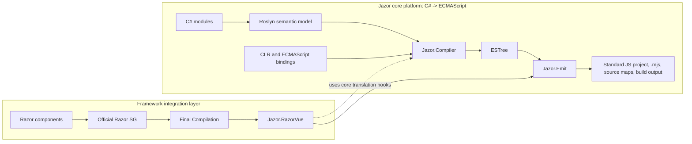

<div align="center">


<h1>Jazor</h1>

<p><strong>A typed .NET toolchain for compiling supported C# semantics into deterministic ECMAScript modules.</strong></p>

<p>
  <a href="https://dotnet.microsoft.com/"></a>
  <a href="https://www.nuget.org/packages/Jazor"></a>
  <a href="https://github.com/devhxj/Jazor/releases/tag/v1.0.0-preview.4"></a>
  <a href="https://github.com/devhxj/Jazor/actions/workflows/razorvue-ci.yml"></a>
  <a href="LICENSE.txt"></a>
</p>

<p>
  <a href="docs/04-roadmap/current-status.md"></a>
  <a href="docs/04-roadmap/current-status.md"></a>
  <a href="docs/04-roadmap/current-status.md"></a>
</p>

<p><a href="docs/03-guides/quick-start.md">Quick start</a> · <a href="docs/README.md">Documentation</a> · <a href="CHANGELOG.md">Changelog</a></p>

<p><strong>English</strong> · <a href="README_CN.md">简体中文</a></p>

</div>

> Jazor 1.0.0-preview.4 is the current preview release.

Jazor is a typed .NET toolchain for compiling supported C# semantics into deterministic ECMAScript modules. It is framework-neutral at its core: Roslyn supplies the semantic model, `Jazor.Compiler` lowers it to ESTree, and `Jazor.Emit` materializes browser artifacts.

Razor-to-Vue is a separate application direction built on that core. `Jazor.RazorVue` binds the final output of the official Razor Source Generator, then delegates all C# expression and member semantics to the same Jazor compiler before it frames Vue render-function modules.

## AI-assisted development

The initial implementations of Jazor's core compiler, RazorVue, and CLR support, together with the first 500 tests, were written by hand over nearly two years. This work established the project's technical foundation.

AI assistance has primarily helped advance documentation, test coverage, external library bindings, iterative improvements, CI, and version management. The Zhipu GLM-5 and GPT-5 series have been the main AI collaborators in this subsequent work; maintainers continue to guide the project, review changes, and make release decisions.

## Acknowledgements

Jazor builds on [Roslyn](https://github.com/dotnet/roslyn), [Acornima](https://github.com/adams85/acornima), [Netpack](https://github.com/FlorianRappl/netpack), [DenoHost](https://github.com/thomas3577/DenoHost), [WebRef](https://github.com/w3c/webref), and earlier C#-to-JavaScript projects including [WootzJs](https://github.com/kswoll/WootzJs), [h5](https://github.com/curiosity-ai/h5), and [SharpKit](https://github.com/SharpKit/SharpKit).

## Core Model



`Jazor.RazorVue` is the current framework integration. Future directions such as `Jazor.React` or `Jazor.RazorReact` may reuse the same core, but they are not current supported APIs.

## Quality Gates

The badges above show maintained acceptance thresholds rather than a stale one-off result. The repository verifies the following minimums through repeatable scripts:

- Core compiler: at least 10,000 passing `IOperation` scenarios, 98% line coverage, and 97% branch coverage.
- Current Razor-to-Vue integration: at least 4,000 passing scenarios, 90% line coverage, and 94% branch coverage while the integration work continues.
- Vue ecosystem bindings: at least 90% audited public binding-contract coverage per target.

Run `verify-compiler-coverage.cs`, `verify-razorvue-coverage.cs`, or `verify-vue-binding-coverage.cs` under `scripts/csharp/` to reproduce the relevant gate. Run `dotnet run --file scripts/csharp/verify-binding-documentation.cs -- --no-build --baseline HEAD` to verify that public ECMAScript and binding declarations retain XML documentation, upstream source metadata, and package XML delivery. The active scope and test entry points are listed in [Current Status](docs/04-roadmap/current-status.md).

## Packages

| Package | Responsibility |
| --- | --- |
| `Jazor` | Framework-neutral compiler, CLR contracts, analyzer, emit tooling, MSBuild and ASP.NET Core integration; suitable for ordinary ECMAScript libraries |
| `Jazor.Vue` | Vue authoring, Razor-to-Vue opt-in, Vue runtime assets, `ECMAScript.Vue` and `ECMAScript.VueContract` payload |
| `ECMAScript.*` | Framework-neutral ECMAScript bindings plus optional Vue ecosystem bindings and CSS-in-JS libraries |
| `ECMAScript.VueDataUi` | Typed `Vd*` RazorVue charts with per-component local ESM materialization; [prefix migration](src/ECMAScript.VueDataUi/README.md#razor-使用) |
| `ECMAScript.Lucide` | Typed `Lucide / lucide-vue-next` RazorVue icons with static per-icon and dynamic catalog paths |
| `Jazor.Admin` | UI-library-neutral admin-shell library and RazorVue components |

[`samples/JazorAdmin`](samples/JazorAdmin) is the production-grade admin reference application that consumes [`Jazor.Admin`](src/Jazor.Admin/README.md); it is not part of the library's public contract.

### Library forms and direct references

A library has exactly one of these two JavaScript carriers. RazorVue is an authoring mode of the
pure Jazor form, not a third carrier.

| Library form | Carrier | Direct reference rule |
| --- | --- | --- |
| JS resource library (`ECMAScript`, Vue, Vuetify, Pinia, and other libraries that already own `.mjs`/`.js`) | Package metadata projected into a standard `jazor/` project (`package.json`, `deno.lock`, restored `node_modules`, and explicitly declared embedded packages) | The package declares its upstream npm/JSR identity, exports, side effects, and resource edges; Emit restores one shared graph for browser and SSR profiles. |
| Pure Jazor library (`ECMAScript.Style`, `Jazor.Admin`, or other developer-authored C# and RazorVue) | Assembly `Jazor.Generated.ModuleCatalog` (`ECMAScriptCode`) | A pure Jazor authoring project directly references `Jazor`; a RazorVue authoring project directly references both `Jazor` and `Jazor.Vue`. |

The final executable or web host directly references `Jazor` when it runs Emit. It collects the
selected `ModuleCatalog` modules and manifest resources once; Debug, Release, SSR, and HMR are
output projections of that same closure, not additional library forms.

`ModuleCatalog` is the standard assembly output for pure Jazor because the analysis/source-generator
pipeline emits C#; it is not a legacy compatibility carrier.

## Install

For a pure Jazor library (C# compiled to ECMAScript) or the final host, add the core package
directly:

```bash
dotnet add package Jazor --version 1.0.0-preview.4
```

For a Razor SDK project that authors RazorVue components, add both packages directly and keep
their versions aligned:

```xml
<ItemGroup>
  <PackageReference Include="Jazor" Version="1.0.0-preview.4" />
  <PackageReference Include="Jazor.Vue" Version="1.0.0-preview.4" PrivateAssets="all" />
</ItemGroup>
```

Detailed package selection, output settings, SSR configuration, and ecosystem bindings are in [Installation and Configuration](docs/03-guides/installation-and-configuration.md).

## First Module

Use `[ECMAScriptModule]` to make a C# module eligible for JavaScript emission:

```csharp
using ECMAScript;

namespace MyApp;

[ECMAScriptModule("shared/greetings.mjs")]
public static class GreetingModule
{
    public static string Compose(string name) => $"Hello, {name}";
}
```

The core compiler emits a standard named-export ECMAScript module. Cross-module calls are resolved through compiler-owned imports rather than hand-written JavaScript.

For a complete runnable path, see [Quick Start](docs/03-guides/quick-start.md).

## Output Modes

The executable or web host selects its artifact mode through MSBuild:

```xml
<PropertyGroup>
  <JazorMode>debug</JazorMode>
  <JazorDir>$(MSBuildProjectDirectory)\jazor\</JazorDir>
</PropertyGroup>
```

| Mode | Result |
| --- | --- |
| `none` | Default; no Jazor artifacts are written |
| `debug` | Standard JS project with inspectable modules and external source maps; Emit state stays in `obj` |
| `release` | Production browser output through the project's configured JavaScript build tool |

Set `JazorSSR=true` with the supported SSR setup when an ASP.NET Core application needs Vue server rendering and hydration. See [Artifact Pipeline](docs/02-architecture/artifact-pipeline.md).

## Documentation

| Need | Entry |
| --- | --- |
| Product overview | [docs/README.md](docs/README.md) |
| Core compiler architecture | [Compiler](docs/02-architecture/compiler.md) |
| Framework integration rules | [Framework Integrations](docs/02-architecture/framework-integrations.md) |
| Current Razor-to-Vue implementation | [Razor-to-Vue](docs/02-architecture/razor-to-vue.md) |
| Install, configure, and author | [Guides](docs/03-guides/README.md) |
| Examples | [Examples](docs/03-guides/examples.md) |
| Current scope | [Roadmap](docs/04-roadmap/current-status.md) |
| Historical context | [Evolution](docs/05-history/evolution.md) |
| Release history | [CHANGELOG.md](CHANGELOG.md) |

## Development

Use the .NET 11 SDK preview selected by [global.json](global.json). From the repository root:

```bash
dotnet restore Jazor.slnx
dotnet build Jazor.slnx
dotnet run --file scripts/csharp/test-dotnet.cs
```

Focused suites include:

```bash
dotnet test src/Jazor.CompilerTest/Jazor.CompilerTest.csproj
dotnet test src/Jazor.RazorVue.Sg.Test/Jazor.RazorVue.Sg.Test.csproj
dotnet test src/Jazor.EmitTest/Jazor.EmitTest.csproj
```

Repository automation uses single-file C# entry points under `scripts/csharp/`. See [Development and Testing](docs/03-guides/development-and-testing.md) for the full workflow.

## Release status

### Jazor 1.0.0-preview.4 · 2026-09-22

- Standard JavaScript project output now uses direct ESM paths, Deno lockfiles and the configured frontend build tool for browser development, HMR and production output.
- npm/JSR bindings now use upstream public entrypoints, typed `[Style]` side-effect imports and a single dependency graph; VuIcons is retired and Lucide is the supported icon binding.
- CLR carrier imports, RazorVue output, SSR worker invalidation and ASP.NET Core proxy/HMR paths now share the standard project root and are covered by the release gates.
- This is a preview release; stable 1.0 has not been published. See [Current Status](docs/04-roadmap/current-status.md) for supported scope and quality gates.

Use the [official release page](https://github.com/devhxj/Jazor/releases/tag/v1.0.0-preview.4) and matching Git tag as the version reference. Mirrors may lag behind or show an older stable release when previews are hidden. Keep all Jazor/ECMAScript packages on the same version and explicitly select `1.0.0-preview.4`.

The main branch may contain unreleased changes. Read [Unreleased and version history](CHANGELOG.md) before applying main-branch examples to an installed package.

## License and Feedback

Jazor is licensed under the [MIT License](LICENSE.txt). Report security issues privately through [GitHub Security Advisories](https://github.com/devhxj/Jazor/security/advisories/new); use [issues](https://github.com/devhxj/Jazor/issues) and [discussions](https://github.com/devhxj/Jazor/discussions) for other feedback.
