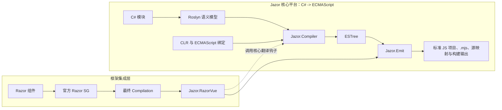

<div align="center">


<h1>Jazor</h1>

<p><strong>将受支持的 C# 语义编译为确定性 ECMAScript 模块的强类型 .NET 工具链。</strong></p>

<p>
  <a href="https://dotnet.microsoft.com/"></a>
  <a href="https://www.nuget.org/packages/Jazor"></a>
  <a href="https://github.com/devhxj/Jazor/releases/tag/v1.0.0-preview.4"></a>
  <a href="https://github.com/devhxj/Jazor/actions/workflows/razorvue-ci.yml"></a>
  <a href="LICENSE.txt"></a>
</p>

<p>
  <a href="docs/04-roadmap/current-status.md"></a>
  <a href="docs/04-roadmap/current-status.md"></a>
  <a href="docs/04-roadmap/current-status.md"></a>
</p>

<p><a href="docs/03-guides/quick-start.md">快速开始</a> · <a href="docs/README.md">文档</a> · <a href="CHANGELOG.md">更新日志</a></p>

<p><a href="README.md">English</a> · <strong>简体中文</strong></p>

</div>

> Jazor 1.0.0-preview.4 是当前预览版本。

Jazor 是一套将受支持 C# 语义转换为确定性 ECMAScript 模块的强类型 .NET 工具链。它的核心不依赖 Vue、React 或其他 UI 框架：Roslyn 提供语义模型，`Jazor.Compiler` 将其降低为 ESTree，`Jazor.Emit` 负责物化浏览器产物。

Razor-to-Vue 是建立在该核心之上的一个应用方向。`Jazor.RazorVue` 绑定官方 Razor Source Generator 的最终输出，再将所有 C# 表达式和成员语义交给同一套 Jazor 编译器，最后组装 Vue render-function 模块。

## AI 协作开发

Jazor 核心编译器、RazorVue 和 CLR 支持的第一版，以及首批 500 个测试，均由人工手写完成，前后投入近两年时间，奠定了项目的技术基础。

在此基础上，AI 主要协助推进文档完善、测试覆盖、外部库封装、迭代优化，以及 CI 和版本管理。后续协作主要使用智谱 GLM-5 系列和 GPT-5 系列；项目方向、代码审查和发版决策仍由维护者负责。

## 致谢

Jazor 使用了 [Roslyn](https://github.com/dotnet/roslyn)、[Acornima](https://github.com/adams85/acornima)、[Netpack](https://github.com/FlorianRappl/netpack)、[DenoHost](https://github.com/thomas3577/DenoHost)、[WebRef](https://github.com/w3c/webref)，并参考了 [WootzJs](https://github.com/kswoll/WootzJs)、[h5](https://github.com/curiosity-ai/h5)、[SharpKit](https://github.com/SharpKit/SharpKit) 等早期 C# 到 JavaScript 项目。

## 核心模型



`Jazor.RazorVue` 是当前已实现的框架集成。未来的 `Jazor.React`、`Jazor.RazorReact` 等方向可以复用同一核心，但目前不是已支持的 API。

## 质量门槛

顶部徽标展示持续适用的验收门槛，而非会过期的单次构建结果。仓库通过可复现脚本验证以下最低要求：

- 核心编译器：至少 10,000 个通过的 `IOperation` 场景、98% 行覆盖率和 97% 分支覆盖率。
- 当前 Razor-to-Vue 集成：至少 4,000 个通过场景、90% 行覆盖率和 94% 分支覆盖率；该门槛会在集成完善后再提高。
- Vue 生态绑定：每个目标至少 90% 的已审计公共绑定契约覆盖率。

可在 `scripts/csharp/` 下运行 `verify-compiler-coverage.cs`、`verify-razorvue-coverage.cs` 或 `verify-vue-binding-coverage.cs` 复现相应门槛。当前范围与测试入口见[当前状态](docs/04-roadmap/current-status.md)。

## 包组成

| 包 | 职责 |
| --- | --- |
| `Jazor` | 框架无关的编译器、CLR 契约、分析器、emit 工具、MSBuild 与 ASP.NET Core 集成，可用于普通 ECMAScript 类库 |
| `Jazor.Vue` | Vue authoring、Razor-to-Vue opt-in、Vue runtime 资源，以及 `ECMAScript.Vue`、`ECMAScript.VueContract` payload |
| `ECMAScript.*` | 框架无关 ECMAScript 绑定、可选 Vue 生态绑定与 CSS-in-JS 类库 |
| `ECMAScript.VueDataUi` | `Vd*` 强类型 RazorVue 图表与按组件本地 ESM 物化；[前缀迁移](src/ECMAScript.VueDataUi/README.md#razor-使用) |
| `ECMAScript.Lucide` | `Lucide / lucide-vue-next` 的强类型 RazorVue 图标，支持静态单图标与动态 catalog 路径 |
| `Jazor.Admin` | UI 库无关的管理壳库与 RazorVue 组件 |

[`samples/JazorAdmin`](samples/JazorAdmin) 是消费 [`Jazor.Admin`](src/Jazor.Admin/README.md) 的生产级管理参考应用，不属于该库的公共契约。

### 类库形式与直接引用

类库携带 JavaScript 只有以下两种形式。RazorVue 是纯 Jazor 类库的一种 authoring 场景，
不是第三种 carrier。

| 类库形式 | carrier | 直接引用规则 |
| --- | --- | --- |
| JS resource library（`ECMAScript`、Vue、Vuetify、Pinia 及其他已经拥有 `.mjs`/`.js` 的类库） | 包内 `manifest.json + dist/**` | 包声明自己的资源依赖；消费方不会因传递引用获得 Jazor 工具链。 |
| 纯 Jazor 类库（`ECMAScript.Style`、`Jazor.Admin` 或其他开发者编写的 C# 和 RazorVue） | 程序集内 `Jazor.Generated.ModuleCatalog`（`ECMAScriptCode`） | 编写纯 Jazor 模块的项目直接引用 `Jazor`；编写 RazorVue 组件的项目直接引用 `Jazor` 和 `Jazor.Vue`。 |

最终可执行或 Web 宿主运行 Emit 时必须直接引用 `Jazor`。宿主一次收集选中的
`ModuleCatalog` 模块和 manifest 资源；Debug、Release、SSR、HMR 只是同一依赖闭包的输出投影，
不是额外的类库形式。

`ModuleCatalog` 是纯 Jazor 的正式程序集生成格式，因为 analysis/source generator 的标准输出是
C#；它不是遗留兼容载体。

## 安装

纯 Jazor 类库（C# 编译为 ECMAScript）或最终宿主应直接安装核心包：

```bash
dotnet add package Jazor --version 1.0.0-preview.4
```

编写 RazorVue 组件的 Razor SDK 项目必须直接添加两个包，并保持版本一致：

```xml
<ItemGroup>
  <PackageReference Include="Jazor" Version="1.0.0-preview.4" />
  <PackageReference Include="Jazor.Vue" Version="1.0.0-preview.4" PrivateAssets="all" />
</ItemGroup>
```

完整的包选择、输出设置、SSR 配置与生态绑定见[安装与配置](docs/03-guides/installation-and-configuration.md)。

## 第一个模块

使用 `[ECMAScriptModule]` 使 C# 模块进入 JavaScript 发射范围：

```csharp
using ECMAScript;

namespace MyApp;

[ECMAScriptModule("shared/greetings.mjs")]
public static class GreetingModule
{
    public static string Compose(string name) => $"Hello, {name}";
}
```

核心编译器会生成标准的具名导出 ECMAScript 模块。跨模块调用由编译器维护 import，不需要手写 JavaScript。

完整的可运行路径见[快速开始](docs/03-guides/quick-start.md)。

## 输出模式

可执行项目或 Web 宿主通过 MSBuild 选择产物模式：

```xml
<PropertyGroup>
  <JazorMode>debug</JazorMode>
  <JazorDir>$(MSBuildProjectDirectory)\jazor\</JazorDir>
</PropertyGroup>
```

| 模式 | 结果 |
| --- | --- |
| `none` | 默认值，不写入 Jazor 产物 |
| `debug` | 标准 JS 项目、可检查的模块和外部 source map；Emit 增量状态写入 `obj` |
| `release` | 通过项目配置的 JavaScript 构建工具生成生产浏览器产物 |

ASP.NET Core 应用需要 Vue SSR 与 hydration 时，按支持的 SSR 配置设置 `JazorSSR=true`。详见[产物管线](docs/02-architecture/artifact-pipeline.md)。

## 文档

| 需求 | 入口 |
| --- | --- |
| 产品总览 | [docs/README.md](docs/README.md) |
| 核心编译器架构 | [编译器](docs/02-architecture/compiler.md) |
| 框架集成规则 | [框架集成层](docs/02-architecture/framework-integrations.md) |
| 当前 Razor-to-Vue 实现 | [Razor-to-Vue](docs/02-architecture/razor-to-vue.md) |
| 安装、配置与编写 | [使用指南](docs/03-guides/README.md) |
| 示例 | [示例](docs/03-guides/examples.md) |
| 当前范围 | [路线图](docs/04-roadmap/current-status.md) |
| 历史背景 | [演进记录](docs/05-history/evolution.md) |
| 版本历史 | [CHANGELOG.md](CHANGELOG.md) |

## 开发

使用 [global.json](global.json) 指定的 .NET 11 SDK preview。在仓库根目录执行：

```bash
dotnet restore Jazor.slnx
dotnet build Jazor.slnx
dotnet run --file scripts/csharp/test-dotnet.cs
```

常用聚焦测试：

```bash
dotnet test src/Jazor.CompilerTest/Jazor.CompilerTest.csproj
dotnet test src/Jazor.RazorVue.Sg.Test/Jazor.RazorVue.Sg.Test.csproj
dotnet test src/Jazor.EmitTest/Jazor.EmitTest.csproj
```

仓库自动化使用 `scripts/csharp/` 下的单文件 C# 入口。完整流程见[开发与测试](docs/03-guides/development-and-testing.md)。

## 发布状态

### Jazor 1.0.0-preview.4 · 2026-09-22

- 标准 JavaScript 项目输出现在直接使用 ESM 路径、Deno lockfile 和项目配置的前端构建工具，支持浏览器开发、HMR 与生产构建。
- npm/JSR 绑定统一使用上游公开入口、强类型 `[Style]` 副作用导入和单一依赖图；VuIcons 已退役，Lucide 成为受支持的图标绑定。
- CLR carrier 导入、RazorVue 输出、SSR worker 失效和 ASP.NET Core 代理/HMR 路径统一使用标准项目根，并纳入发版门禁。
- 当前为预发布版本，稳定版 1.0 尚未发布；支持范围与质量门禁见[当前状态](docs/04-roadmap/current-status.md)。

版本以[主仓库发布页](https://github.com/devhxj/Jazor/releases/tag/v1.0.0-preview.4)及对应 Git tag 为准。镜像可能同步滞后，隐藏预发布版本时也可能只显示旧稳定版。所有 Jazor/ECMAScript 包保持同版本，安装时显式指定 `1.0.0-preview.4`。

主分支可能包含尚未发布的改动。将主分支示例用于已安装包前，请核对[未发布改动与版本历史](CHANGELOG.md)。

## 许可证与反馈

Jazor 使用 [MIT 许可证](LICENSE.txt)。安全问题请通过 [GitHub Security Advisories](https://github.com/devhxj/Jazor/security/advisories/new) 私下报告；其他问题可使用 [Issues](https://github.com/devhxj/Jazor/issues) 或 [Discussions](https://github.com/devhxj/Jazor/discussions)。
