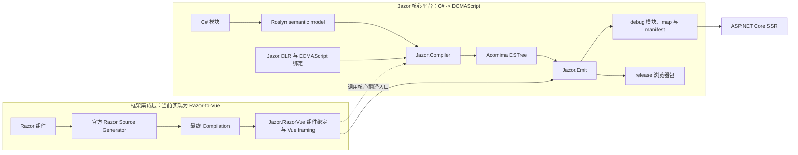

# 系统架构

> 适用范围：Jazor 当前的生产数据流与职责边界。

## 主链路

## 职责边界

| 层 | 责任 | 不负责的事项 |
| --- | --- | --- |
| Roslyn 与 Razor SG | 提供已绑定的语义、诊断和最终组件生成结果 | 生成 JavaScript 或浏览器资源 |
| `Jazor.Compiler` | Jazor 核心：将 `IOperation` 降低为 ESTree；维护导入、临时名、源位置和宿主映射边界 | 读取 Razor 文本、写入文件或运行开发服务器 |
| `Jazor.RazorVue` | 基于 Jazor 核心的应用层：绑定生成的 `BuildRenderTree`，处理 Vue 特有的组件 framing | 重新实现 C# 表达式和成员语义 |
| `Jazor.Emit` | 收集 catalog、物化模块/源映射/manifest、调用 Netpack | 决定 C# lowering 规则 |
| ASP.NET Core 集成 | 承载静态资源、SSR 与 hydration | 替代浏览器打包器或编译器 |

## 核心约束

1. Jazor 核心的职责是将 C# 语义通过 Roslyn 和 `Jazor.Compiler` 的正式翻译入口变为 ECMAScript。
2. Razor-to-Vue 只能作为核心之上的应用层调用该入口，不能重新实现 C# lowering。
3. Razor-to-Vue 的生产输入是官方 Razor SG 完成后的最终 `Compilation`，不是 Razor IR 或自行解析的中间文本。
4. 宿主 API 由白名单和映射定义；不支持的运行时语义必须显式失败。
5. 模块名称、导入别名、临时变量和源映射锚点必须保持确定性；产物物化与打包属于 `Jazor.Emit`。

框架集成层的扩展约束见 [框架集成层](../02-architecture/framework-integrations.md)。当前 Razor-to-Vue 的具体设计见 [Razor-to-Vue](../02-architecture/razor-to-vue.md)；核心与交付层见 [编译器](../02-architecture/compiler.md) 和 [产物管线](../02-architecture/artifact-pipeline.md)。
