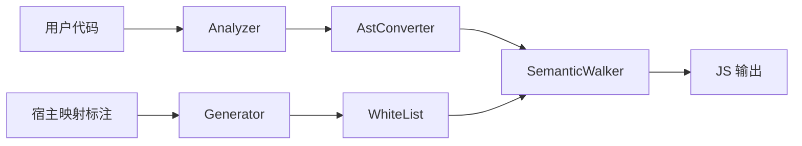

# Architecture Overview Simplified

## 1. One-Page Summary

Jazor 的整体方案可以压缩成 4 层：

1. 输入域  
   用户模块代码通过 `[ECMAScriptModule]` / `[ECMAScript]` 进入编译域；宿主映射通过 `[Jazor(Op.*)]` 描述外部 API 如何映射。

2. 宿主映射规则层  
   `Jazor.Compiler.Generator` 扫描 `ECMAScript.dll` 和 `Jazor.CLR.dll` 上的 `[Jazor]`，自动生成白名单和 Compile 映射。

3. 转换层  
   `Jazor.Analyzer` 先过滤非法输入；`AstConverter` 处理模块级转换；`SemanticWalker` 处理语义级转换。

4. 输出闭环层  
   转换结果先落到 ESTree，再序列化为 JavaScript / catalog / map carriers，最后由 `Jazor.Emit` 物化文件并由测试回归验证。

## 2. Simplified Pipeline

```mermaid
flowchart TD
    A[用户模块代码] --> B[Analyzer]
    B --> C[AstConverter]
    C --> D[SemanticWalker]
    D --> E[ESTree]
    E --> F[JavaScript]

    G[ECMAScript / Jazor.CLR<br/>Jazor(Op.*)] --> H[Compiler.Generator]
    H --> I[WhiteList + Compile 映射]
    I --> D
```

## 3. Core Roles

### 3.1 Analyzer

`Jazor.Analyzer` 负责“能不能进来”：

- 非法类型引用
- 非白名单成员访问
- 不支持的语法
- 错误的模块声明位置

它的职责是收紧输入域，而不是生成 JavaScript。

### 3.2 AstConverter

`AstConverter` 负责“模块级转换怎么展开”：

- 静态字段
- 静态属性
- 静态方法
- 嵌套类型
- 枚举

它只处理模块级转换，不解决方法体内部语义。

当前已经固定下来的模块级路线还包括：

- `enum` 声明擦除，不生成 runtime declaration object
- `interface` 只作为契约存在，不发射 runtime artifact
- 成员类继承支持同模块 JS-compatible 子集：`extends` / `super(...)` / `super.member`
- 成员类构造函数重载走单真实 `constructor` + `$ctor_<hash>` helper + `arguments.length` dispatcher

### 3.3 SemanticWalker

`SemanticWalker` 负责“语义级转换怎么做”：

- 表达式
- 语句
- 模式匹配
- `switch`
- tuple
- `try/catch`
- 字符串插值
- 对象/数组创建
- 字段/属性/方法引用

它以 Roslyn `IOperation` 为输入，以 ESTree 为输出。

当前已经固定下来的语义级路线包括：

- `tuple` 作为表达式组合 lowering 处理
- `ref/out` 作为 caller/callee 协议模拟处理
- `enum` 使用点常量化
- runtime host / member shape 优先贴近真实 JS 形态

### 3.4 WhiteList

`WhiteList` 负责“外部 API 怎么映射”：

- `Alias`
- `Inline`
- `Import`
- `Compile`

这部分不应手写散落在转换器中，而应由宿主映射标注自动生成。

## 4. Responsibility Boundary



记忆方式：

- `Analyzer` 管合法性
- `WhiteList` 管宿主映射
- `AstConverter` 管模块级转换
- `SemanticWalker` 管语义级转换

## 5. Current Closure Status

### 已闭环

- 宿主标注扫描
- 白名单生成
- Analyzer 输入约束
- SemanticWalker 主链路
- `Op.Compile` 生成、装配与主分发 baseline
- 编译测试回归

### 基本闭环

- AstConverter 模块级转换
- `Alias` / `Inline` / `Import` 消费
- import 收集、合并、模块头输出主链
- enum / interface declaration 擦除
- 成员类继承子集
- 成员类构造函数重载 dispatcher
- compiler catalog -> emit 文件物化链路

### 后续重点

- `Op.Compile` contract 与 AST 模板边界增强
- catalog -> emit 物化与 sourcemap 稳定性继续压实
- source-origin / sourcemap 稳定性继续压实

## 6. New Feature Decision Rule

新增一个能力时，先判断它属于哪一类：

- 输入是否合法：放到 `Analyzer`
- 外部 API 如何映射：放到 `WhiteList`
- 模块/类成员如何展开：放到 `AstConverter`
- 方法体表达式/语句如何转换：放到 `SemanticWalker`
- 字符串模板无法稳定表达结构：升级到 AST 模板或 `Op.Compile`

## 7. One-Sentence Conclusion

Jazor 当前的核心不是“把 C# 拼成 JS 字符串”，而是用 `Analyzer + WhiteList + AstConverter + SemanticWalker` 建一条可验证、可扩展、可回归的语义转换链路。

## 8. Where To Read Next

如果要继续深入，建议顺序如下：

1. [ArchitectureOverview.md](./ArchitectureOverview.md)：完整版架构图与职责边界
2. [SyntaxTransformationPipeline.md](./SyntaxTransformationPipeline.md)：端到端链路
3. [WhiteList.md](./WhiteList.md)：宿主映射规则
4. [SemanticWalker.md](./semantic-walker/SemanticWalker.md)：主转换器入口
