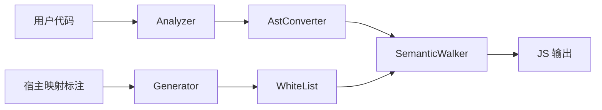

# Architecture Overview Simplified

## 整体架构

Jazor 可以压缩成 4 层：

1. **输入域** — 用户模块代码通过 `[ECMAScriptModule]` / `[ECMAScript]` 进入编译域；宿主映射通过 `[Jazor(Op.*)]` 描述外部 API 如何映射。
2. **宿主映射规则层** — `Jazor.Compiler.Generator` 扫描 `ECMAScript.dll` 和 `Jazor.CLR.dll` 上的 `[Jazor]`，自动生成白名单和 Compile 映射。
3. **转换层** — `Jazor.Analyzer` 先过滤非法输入；`AstConverter` 处理模块级转换；`SemanticWalker` 处理语义级转换。
4. **输出闭环层** — 转换结果落到 ESTree，再序列化为 JavaScript / catalog / map carriers，最后由 `Jazor.Emit` 物化文件。

## Pipeline

```mermaid
flowchart TD
    A[用户模块代码] --> B[Analyzer]
    B --> C[AstConverter]
    C --> D[SemanticWalker]
    D --> E[ESTree]
    E --> F[JavaScript]

    G[ECMAScript / Jazor.CLR<br/>Jazor(Op.*)] --> H[Compiler.Generator]
    H --> I[WhiteList + Compile 映射]
    I --> D
```

## 核心角色

### Analyzer

`Jazor.Analyzer` 负责"能不能进来"——非法类型引用、非白名单成员访问、不支持的语法、错误的模块声明位置。它收紧输入域，不负责生成 JavaScript。

### AstConverter

`AstConverter` 负责"模块级转换怎么展开"——静态字段、静态属性、静态方法、嵌套类型、枚举。它只处理模块级，不涉及方法体内部语义。

已固定的模块级路线：

- `enum` 擦除，不生成 runtime declaration object
- `interface` 只做契约，不发射 runtime artifact
- `record` 不发射 runtime declaration，保留 structural lowering 语义
- 模块导出只支持 named export；导出名解析为 `default` 时必须显式失败
- 成员类继承支持同模块 JS-compatible 子集：`extends` / `super(...)` / `super.member`
- 成员类构造函数重载走单真实 `constructor` + `$ctor_<hash>` helper + 已绑定构造函数 selector dispatcher

### SemanticWalker

`SemanticWalker` 负责"语义级转换怎么做"——表达式、语句、模式匹配、`switch`、tuple、`try/catch`、字符串插值、对象/数组创建、字段/属性/方法引用。它以 Roslyn `IOperation` 为输入，ESTree 为输出。

已固定的语义级路线：

- `tuple` 作为表达式组合 lowering 处理
- `ref/out` 作为 caller/callee 协议模拟处理
- `enum` 使用点常量化
- `record` 创建、`with`、位置/属性模式与解构统一按结构属性键处理
- runtime host / member shape 优先贴近真实 JS 形态

### WhiteList

`WhiteList` 负责"外部 API 怎么映射"——`Alias`、`Inline`、`Import`、`Compile`。不应手写散落在转换器中，由宿主映射标注自动生成。

## 职责边界



一句话总结：`Analyzer` 管合法性，`WhiteList` 管宿主映射，`AstConverter` 管模块级转换，`SemanticWalker` 管语义级转换。

## 闭环状态

已闭环：宿主标注扫描、白名单生成、Analyzer 输入约束、SemanticWalker 主链路、`Op.Compile` 生成与主分发 baseline、编译测试回归。

基本闭环：AstConverter 模块级转换、`Alias`/`Inline`/`Import` 消费、import 收集合并与模块头输出、enum/interface 擦除、成员类继承与构造函数重载、compiler catalog → emit 物化链路。

后续重点：`Op.Compile` contract 与 AST 模板边界增强、catalog → emit 与 sourcemap 稳定性巩固。

## 新增能力时怎么判断放哪里

- 输入是否合法 → `Analyzer`
- 外部 API 如何映射 → `WhiteList`
- 模块/类成员如何展开 → `AstConverter`
- 方法体表达式/语句如何转换 → `SemanticWalker`
- 字符串模板无法稳定表达结构 → 升级到 AST 模板或 `Op.Compile`

## 延伸阅读

1. [ArchitectureOverview.md](./ArchitectureOverview.md)：完整版架构图与职责边界
2. [SyntaxTransformationPipeline.md](./SyntaxTransformationPipeline.md)：端到端链路
3. [WhiteList.md](./WhiteList.md)：宿主映射规则
4. [SemanticWalker.md](./semantic-walker/SemanticWalker.md)：主转换器入口
