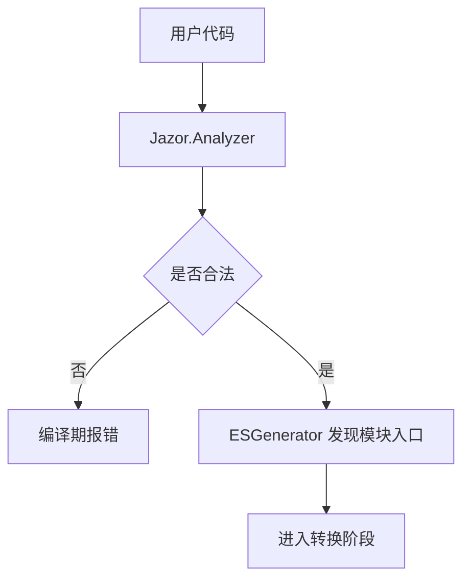
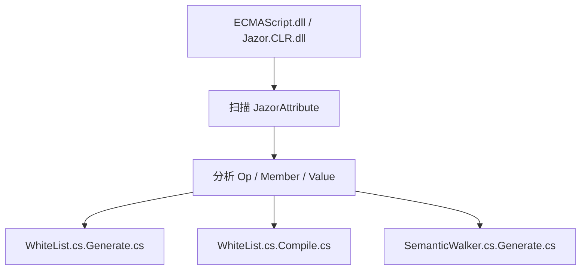
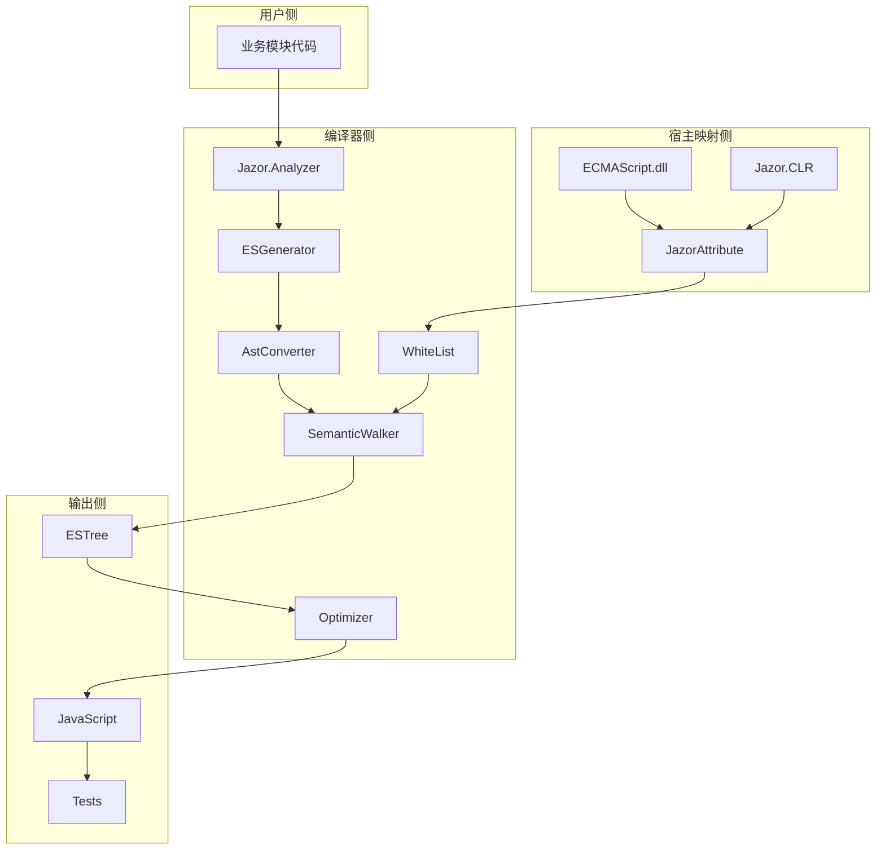
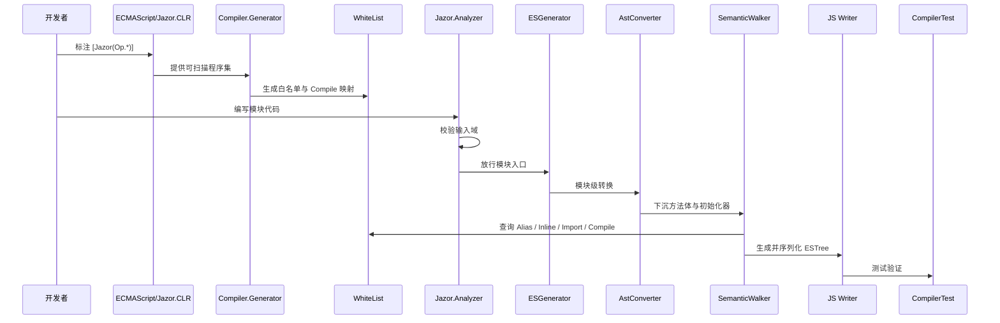
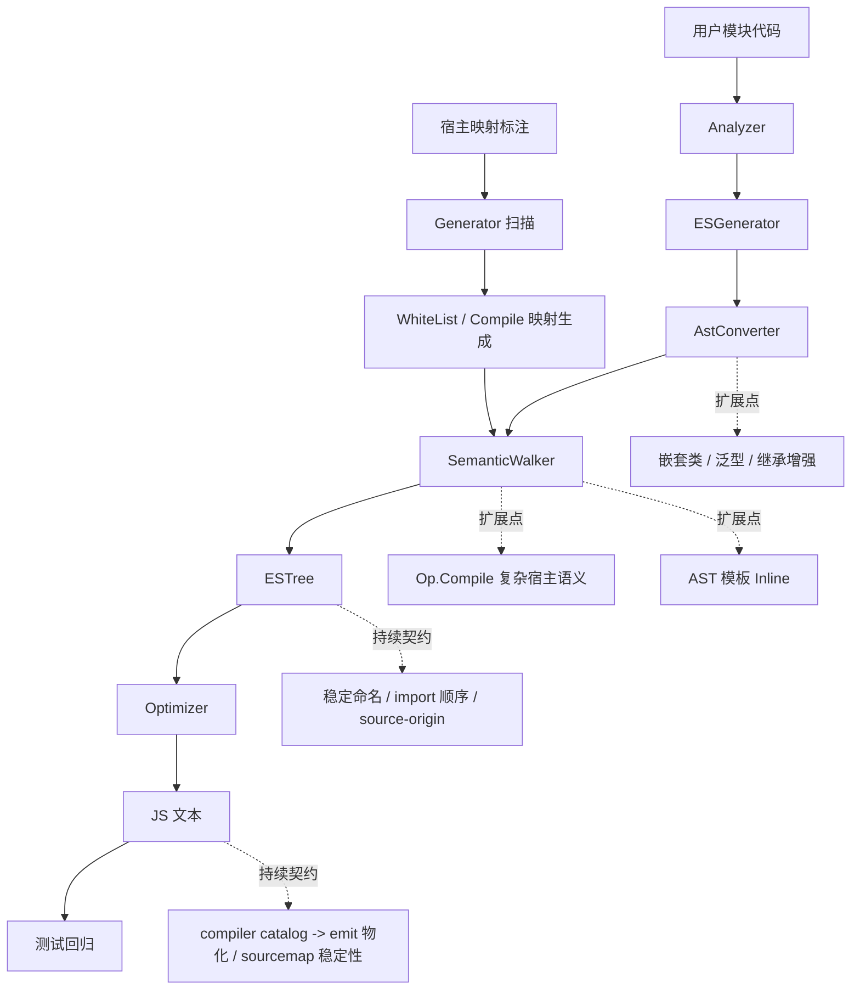
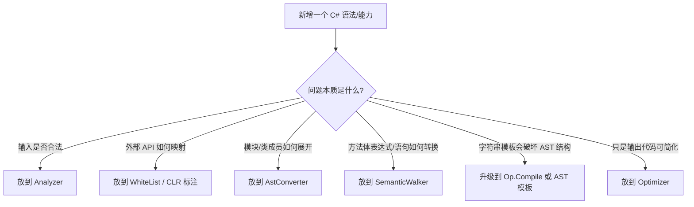

# Architecture Overview

## 目录

- [1. Overview](#1-overview)
- [2. End-to-End Pipeline](#2-end-to-end-pipeline)
- [3. Inputs And Metadata](#3-inputs-and-metadata)
- [4. Compile-Time Guard](#4-compile-time-guard)
- [5. Rule Generation](#5-rule-generation)
- [6. Conversion Core](#6-conversion-core)
- [7. Internal Responsibility Boundary](#7-internal-responsibility-boundary)
- [8. Sequence From Annotation To Output](#8-sequence-from-annotation-to-output)
- [9. Closure Status And Extension Points](#9-closure-status-and-extension-points)
- [10. Extension Decision Tree](#10-extension-decision-tree)
- [11. Key Engineering Principles](#11-key-engineering-principles)
- [12. Recommended Reading Order](#12-recommended-reading-order)
- [13. Preferred Terms](#13-preferred-terms)
- [14. Related Documents](#14-related-documents)

## 1. Overview

Jazor 当前整体方案是一条“输入域 + 宿主映射 + 转换核心 + 输出闭环”的链路：

- 用户模块代码通过 `[ECMAScriptModule]` / `[ECMAScript]` 进入编译域
- 宿主映射通过 `[Jazor(Op.*)]` 提供可消费的外部 API 规则
- `AstConverter` 与 `SemanticWalker` 构成转换核心
- 最终产出为 ESTree、JavaScript 文本与 catalog/map carriers，随后由 `Jazor.Emit` 物化为文件

其中：

- `Jazor.Analyzer` 负责收紧输入域
- `Jazor.Compiler.Generator` 负责从宿主标注自动生成白名单与 Compile 映射
- `AstConverter` 负责模块级转换
- `SemanticWalker` 负责 `IOperation -> ESTree` 的语义级转换

## 2. End-to-End Pipeline

```mermaid
flowchart LR
    subgraph A[Input]
        U[用户 C# 模块代码<br/>ECMAScriptModule / ECMAScript]
        R[宿主映射<br/>ECMAScript.dll + Jazor.CLR.dll<br/>Jazor(Op.*)]
    end

    subgraph B[Generation]
        G[Jazor.Compiler.Generator]
        W1[WhiteList.cs.Generate.cs]
        W2[WhiteList.cs.Compile.cs]
        W3[SemanticWalker.cs.Generate.cs]
    end

    subgraph C[Compile-Time Guard]
        AN[Jazor.Analyzer]
        ESG[ESGenerator]
    end

    subgraph D[Conversion Core]
        AC[AstConverter]
        SW[SemanticWalker]
        SA[SenseArgument]
        WL[WhiteList 消费]
    end

    subgraph E[Output]
        AST[Acornima ESTree]
        OP[Optimizer]
        JS[ToKnRECMAScript / ToECMAScript]
        T[Compiler Tests]
    end

    R --> G
    G --> W1
    G --> W2
    G --> W3

    U --> AN
    AN --> ESG
    ESG --> AC
    AC --> SW

    W1 --> WL
    W2 --> WL
    W3 --> WL
    WL --> SW
    SA <--> SW

    SW --> AST
    AST --> OP
    OP --> JS
    JS --> T
```

## 3. Inputs And Metadata

### 3.1 User-side annotations

用户代码主要通过以下特性进入编译域：

- `[ECMAScriptModule]`：模块入口
- `[ECMAScript]`：允许类型
- `[ECMAScriptName]`：名称重写

这些特性决定的是“哪些用户代码允许被编译器接受”。

### 3.2 Host-side annotations

宿主映射由 `ECMAScript.dll` 与 `Jazor.CLR.dll` 中的 `[Jazor(Op.*)]` 提供，常见操作包括：

- `Alias`
- `Inline`
- `Import`
- `Compile`
- `Allowed`
- `Discard`

这些标注决定的是“外部 API 如何映射到 JavaScript”。

## 4. Compile-Time Guard



`Jazor.Analyzer` 的职责不是生成代码，而是尽可能在进入转换器前拒绝非法语义，例如：

- 非法外部类型引用
- 非白名单成员访问
- 不支持的语法构造
- 错误的 ES 模块声明位置

## 5. Rule Generation



生成器的核心作用是把宿主映射上的声明式规则，转成编译器可直接消费的静态数据和接口。

约束原则：

- 生成文件不应手改
- 要改映射规则，应回到 `ECMAScript` / `Jazor.CLR` 源头
- `Compile` 只生成接口与映射，具体实现仍需在编译器侧补充

## 6. Conversion Core

### 6.1 AstConverter

`AstConverter` 负责模块级转换，主要处理：

- 静态字段
- 静态属性
- 静态方法
- 嵌套类型
- 枚举

它解决的是“模块顶层长什么样”的问题，而不是“方法体内部怎么变”。

当前已经固定下来的模块级路线还包括：

- `enum` declaration 擦除，不生成 runtime declaration object
- `interface` declaration 擦除，只保编译期契约角色
- `record` declaration 不生成 runtime declaration，只保 structural lowering 语义
- 模块导出固定只支持 named export；若导出名解析为 `default`，必须显式失败
- 成员类继承支持同模块 JS-compatible 子集，真实输出 `extends` / `super(...)` / `super.member`
- 成员类构造函数重载走“单真实 `constructor` + `$ctor_<hash>` helper + 已绑定构造函数 selector dispatcher”

### 6.2 SemanticWalker

`SemanticWalker` 是主转换器，负责语义级转换：

- 表达式
- 语句
- 模式匹配
- `switch`
- tuple
- `try/catch`
- 字符串插值
- 对象/数组创建
- 字段/属性/方法引用

它以 Roslyn `IOperation` 为输入，以 Acornima ESTree 为输出。

当前已经固定下来的语义级路线还包括：

- `tuple` 视为编译期语法糖，按表达式组合 lowering 处理
- `ref/out` 视为 caller/callee 协议模拟，而不是 CLR 地址语义复刻
- `enum` 使用点由 `SemanticWalker` 常量化为底层标量或标量表达式
- `record` 创建、`with`、位置/属性模式与解构统一按结构属性键处理，不保 nominal runtime identity
- `Reference` 域负责已绑定成员的最终宿主与成员名，不负责 runtime 二次 overload dispatch

### 6.3 SenseArgument

`SenseArgument` 承担上下文传播职责，当前主要包括：

- 变量声明提升
- import 规范收集
- 左值/右值语义传递
- 模式匹配上下文
- `ref/out` 等特殊参数语义

它是 `SemanticWalker` 维持作用域与上下文稳定性的核心辅助对象。

## 7. Internal Responsibility Boundary



边界规则应保持清晰：

- `Analyzer` 只做约束
- `WhiteList` 只做宿主映射
- `AstConverter` 只做模块级转换
- `SemanticWalker` 只做语义级转换
- `Optimizer` 只做语义保守优化

## 8. Sequence From Annotation To Output



## 9. Closure Status And Extension Points



状态可分为三类：

### 已闭环

- 宿主标注扫描
- 白名单生成
- `Analyzer` 输入约束
- `SemanticWalker` 主语义转换
- `Op.Compile` 生成、装配与主分发 baseline
- 编译测试回归

### 基本闭环

- `AstConverter` 模块级转换主链路
- `Alias` / `Inline` / `Import` 消费
- import 收集、合并、模块头输出主链
- enum / interface declaration 擦除
- 成员类继承子集
- 成员类构造函数重载 dispatcher
- compiler catalog -> emit 文件物化链路
- `Optimizer` 作为后处理节点存在

### 未完全闭环

- 更复杂的 `Op.Compile` contract 扩展体系
- 更稳健的 AST 模板化 Inline 路径
- output / sourcemap / source-origin 的长期稳定契约继续巩固

## 10. Extension Decision Tree



## 11. Key Engineering Principles

后续扩展时应持续遵守以下原则：

- 用户代码是否允许进入编译域，由 `Analyzer` 决定
- 外部 API 如何映射，由 `WhiteList` 决定
- 模块级结构问题交给 `AstConverter`
- 语义级问题交给 `SemanticWalker`
- 复杂宿主语义优先走 `Op.Compile`
- 生成文件不手改，修改回源头标注
- 所有语义修复都必须由测试回归覆盖

## 12. Recommended Reading Order

建议按以下顺序阅读：

1. [ArchitectureOverview.Simplified.md](./ArchitectureOverview.Simplified.md)
2. [SyntaxTransformationPipeline.md](./SyntaxTransformationPipeline.md)
3. [WhiteList.md](./WhiteList.md)
4. [SemanticWalker.md](./semantic-walker/SemanticWalker.md)
5. [ModuleConversionSpec.md](./ModuleConversionSpec.md)
6. [InlineAstTemplateSpec.md](./InlineAstTemplateSpec.md)

## 13. Preferred Terms

本文档后续统一使用以下术语：

- 输入域：用户代码允许进入编译器的边界
- 宿主映射：外部 API 到 JavaScript 的规则定义
- 模块级转换：`AstConverter` 负责的模块/类结构展开
- 语义级转换：`SemanticWalker` 负责的 `IOperation -> ESTree`
- 输出闭环：从 AST 到最终 JavaScript 产物的完整链路
- 扩展点：设计已预留、实现未完全闭环的能力
- 持续契约：当前已经接通，但仍需持续保持稳定的输出性质，例如命名、导入顺序和 source-origin

## 14. Related Documents

- [README.md](./README.md)：文档总索引
- [SyntaxTransformationPipeline.md](./SyntaxTransformationPipeline.md)：端到端链路细节
- [TransformationClosureChecklist.md](../../02-计划/compiler/TransformationClosureChecklist.md)：闭环与欠账清单
- [WalkerExtensionSpec.md](./WalkerExtensionSpec.md)：`SemanticWalker` 扩展约定
